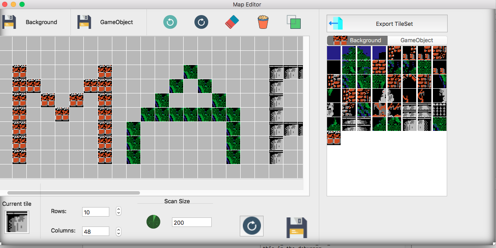

# Map-Editor
Map Editor on OSX

Functions

1. Create Tilemap
2. Save map as quadtree format
3. Add game objects to map
4. Save game objects as quadtree format
5. Save, delete, undo, redo when draw tiles

